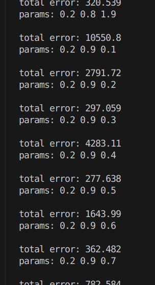
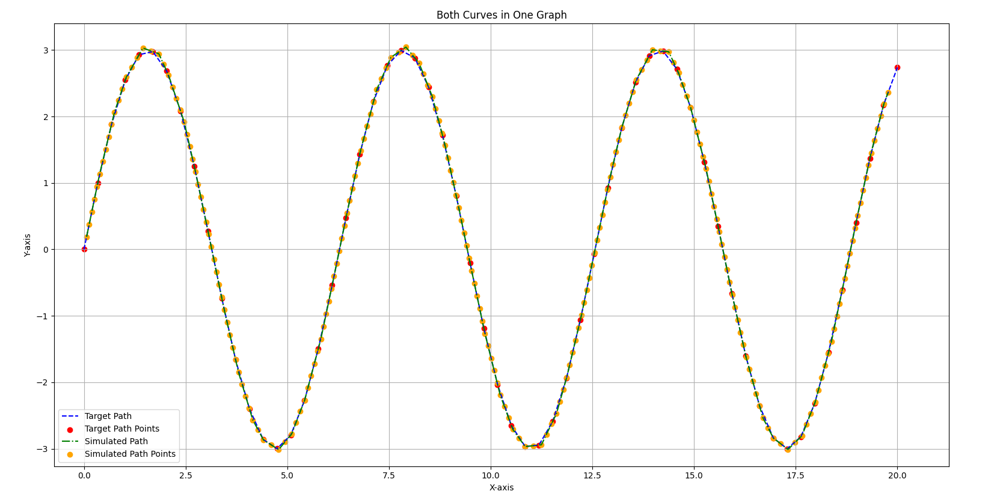
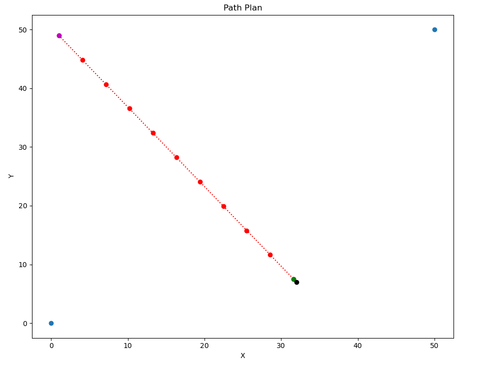

# Motion Planning - SeDriCa-BatMobile

This directory contains the path planning, control, and simulation components for the BatMobile platform.

## Packages

- **`gazebo_car_simulation`**: 3D simulation environment for robot testing
- **`occupancy_matrix`**: Environmental mapping and path planning
- **`rviz_path_simulation`**: Lightweight visualization for algorithm testing

## Gazebo Car Simulation

The `gazebo_car_simulation` package provides a realistic 3D simulation environment for testing the BatMobile's autonomous navigation capabilities.

### Features

- **Differential Drive Model**: Accurate physics-based robot model
- **Custom Environments**: Multiple test scenarios for different navigation challenges
- **ROS2 Control Interface**: Standard interfaces for motor control and sensor data

### Usage

```bash
# Source the workspace
source install/setup.bash

# Launch the simulation environment
ros2 launch gazebo_car_simulation sim.launch.py
```


*Gazebo simulation environment with the BatMobile model*

## PID Control Implementation

The main component of the Motion Planning system is the PID-based path following controller.

### Evolution of PID Implementation

The PID controller has gone through several iterations of improvement:

1. **PIDv1**: Basic implementation using angular error to the next waypoint
2. **PIDv2**: Added visualization tools and fixed logical errors
3. **PIDv3**: Redesigned to use cross-track error for better path adherence
4. **PIDv4**: Implemented automatic parameter tuning
5. **PIDv5/v6 (Latest)**: Enhanced with realistic vehicle kinematics and angular velocity control

### Cross-Track Error Approach

The latest implementation uses cross-track error (perpendicular distance from the path) for control:

```
cross_track_error = perpendicular_distance(current_position, path_segment)
```

This approach provides more accurate path following compared to the initial angle-based methods.

### Auto-Tuning Process

The auto-tuning feature automatically determines optimal PID parameters for a given path:

1. Initializes with conservative parameter values
2. Runs simulation with current parameters
3. Evaluates performance metrics (settling time, overshoot, steady-state error)
4. Adjusts parameters based on performance
5. Repeats until convergence or maximum iterations reached


*PID parameter auto-tuning process*

### Realistic Vehicle Dynamics

The latest version (v5/v6) incorporates:
- Realistic turning mechanics with angular velocity control


*Visualization of path following with PID control. The green line is the path, and the red line is the vehicle trajectory.*

### Running the PID Controller

```bash
# Source the workspace
source install/setup.bash

# Run the latest version
ros2 run pid_controller pid_controller_node
```

## RViz Path Simulation

The `rviz_path_simulation` package provides lightweight visualization for rapid algorithm testing.

### Features

- **Path Visualization**: Display planned paths and robot trajectory
- **Waypoint Management**: Define, save, and load waypoint sets

### Usage

```bash
# Source the workspace
source install/setup.bash

# Launch RViz with the path simulator
ros2 launch rviz_path_simulation path_simulator.launch.py
```


*RViz visualization of path following with cross-track error highlighted*

## Occupancy Matrix

The `occupancy_matrix` package provides environmental mapping and path planning capabilities.

### Features

- **Map Generation**: Create and manipulate occupancy grid maps
- **Target Detection**: Identify and track targets within the environment
- **Path Planning**: Generate optimal paths considering obstacles and targets

### Usage

```bash
# Source the workspace
source install/setup.bash

# Run the occupancy matrix generator
ros2 run occupancy_matrix occupancy_grid_node
```


*Occupancy grid with path planning. Magenta dot is start position, green dot is target position*

## Integrating with IntegratedPipeline

The Motion Planning components can be used together with the IntegratedPipeline for complete robot control:

1. **Path Planning**: The `occupancy_matrix` package identifies targets and plans optimal paths
2. **Path Following**: The PID controller follows the path to approach the target
3. **Target Acquisition**: Once in position, the `batmobile_integrated` package takes over for target tracking and cannon control

## Future Work

- Integration with SLAM for dynamic environment mapping
- Implementation of advanced path planning algorithms (RRT*, A*, D*)
- Expansion of auto-tuning to support adaptive control during operation
- Sensor fusion for improved localization and obstacle detection 