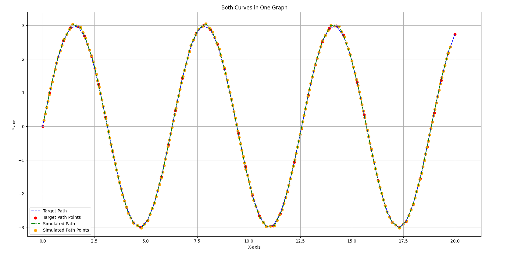
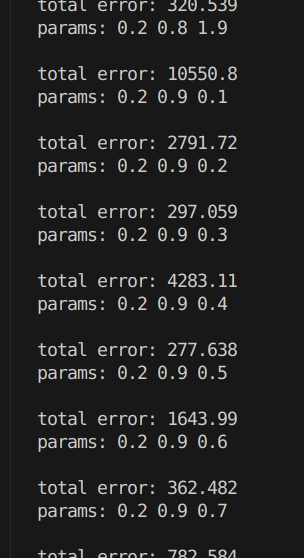
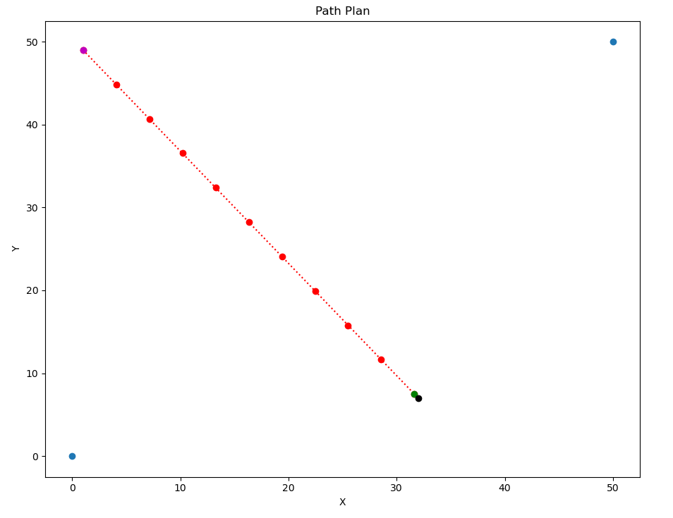

# SeDriCa-BatMobile

<p align="center">
  <br>
  <em>Autonomous Navigation and Target Acquisition System</em>
</p>

## Overview

SeDriCa-BatMobile is an autonomous robotics platform that combines perception, motion planning, and target acquisition capabilities. The system is built on ROS2 and features both integrated control pipelines and simulation environments for testing and development.

## Repository Structure

This repository contains two main components:

- **IntegratedPipeline**: Contains the target detection, tracking, and cannon control system.
- **Motion_Planning**: Includes path planning, PID control for autonomous navigation, and Gazebo simulation environments.

## IntegratedPipeline

### `batmobile_integrated` Package

This package integrates the core logic for the BatMobile's autonomous target acquisition and cannon control.

#### Features

- **Intelligent Target Scanning**: Combined movement and rotation pattern for efficient target detection
- **State Machine Architecture**: Handles scanning, turning, approaching, and shooting phases
- **Cannon Control**: Precision aiming with adjustable angle and firing mechanism

#### Nodes

- **`coordinates_receiver` (Executable)**: Contains two logical nodes managed by an executor:
  - `coordinate_subscriber`: Subscribes to `/get_point` for target coordinates
  - `target_publisher`: Publishes control commands to `/Control_instruction`

#### Topics

- **`/get_point`** (`geometry_msgs/msg/Point`): Input topic for receiving target coordinates (x, y, z)
- **`/Control_instruction`** (`batmobile_integrated/msg/ControlInstructions`): Output topic publishing control commands

#### Custom Messages

- **`ControlInstructions.msg`**:
  - `float32 linear_speed`: Desired forward/backward speed
  - `float32 angular_speed`: Desired turning speed
  - `bool shoot_cannon`: Flag to indicate whether to fire the cannon
  - `float32 cannon_angle`: Desired vertical angle for the cannon in radians

## Motion Planning

The Motion_Planning directory contains tools for path planning, navigation control, and simulation environments.

### Gazebo Car Simulation

The `gazebo_car_simulation` package provides a complete 3D simulation environment for testing the BatMobile's navigation capabilities.


*Gazebo simulation environment with the BatMobile model*

### PID Control Implementation

The system implements an PID controller for precise path following:

#### Evolution of PID Implementation

- **PIDv1**: Basic implementation using angle-based error calculation
- **PIDv2**: Improved with RViz and Matplotlib visualization
- **PIDv3**: Completely revamped to use cross-track error for better accuracy
- **PIDv4**: Implemented auto-tuning capabilities for path-specific optimization
- **PIDv5/v6**: Enhanced to support realistic vehicle kinematics with angular velocity
- **PIDv7**: Thetha and X changed to Angular vel and Linear vel.

#### Key Features

- **Automatic Parameter Tuning**: Self-optimizes PID parameters based on path characteristics (till PIDv4)
- **Cross-Track Error Minimization**: Maintains precise path adherence
- **Visualization Tools**: Real-time performance monitoring with RViz and Matplotlib(for Rviz package and PIDv6. v7 not supported yet.)


*Visualization of the BatMobile following a path with PID control*


*PID parameter auto-tuning process*

### RViz Path Simulation

The `rviz_path_simulation` package provides visualization for testing path planning.

#### Features
- **Path Visualization**: Display planned paths and robot trajectory


*RViz visualization of path following with cross-track error highlighted*

### Occupancy Matrix

The `occupancy_matrix` package provides tools for environmental mapping and path planning.

#### Features

- **Map Generation**: Create arbitrary occupancy grids for testing
- **Target Identification**: Automatic detection of targets within the map
- **Path Planning**: Generate optimal paths to approach targets


*Occupancy grid with path planning. Magenta dot is start position, green dot is target position*

## Building and Running

### Prerequisites

- **ROS2 Humble**: Follow the [official installation guide](https://docs.ros.org/en/humble/Installation.html)
- **Gazebo Fortress**: For simulation environments

### Building the Workspace

1. **Clone the repository**:
   ```bash
   git clone https://github.com/Soni-Shivam/SeDriCa-BatMobile.git
   cd SeDriCa-BatMobile
   ```

2. **Build the IntegratedPipeline**:
   ```bash
   cd IntegratedPipeline
   colcon build
   ```

3. **Build the Motion Planning components**:
   ```bash
   cd ../Motion_Planning
   colcon build
   ```

### Running the System

#### IntegratedPipeline

```bash
# Source the setup file
cd IntegratedPipeline
source install/setup.bash

# Launch the main system
ros2 launch batmobile_integrated batmobile.launch.py
```

#### Gazebo Simulation

```bash
# Source the setup file
cd Motion_Planning
source install/setup.bash

# Launch the Gazebo simulation
ros2 launch gazebo_car_simulation sim.launch.py
```
## Contributing

Contributions to the SeDriCa-BatMobile project are welcome! Please follow these steps:

1. Fork the repository
2. Create a feature branch
3. Make your changes
4. Submit a pull request

## Acknowledgments

- Thanks to all contributors who have helped develop the SeDriCa-BatMobile project.
